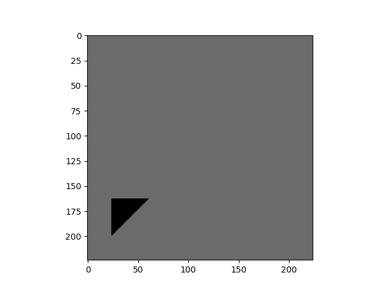
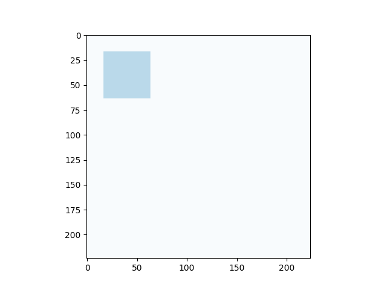
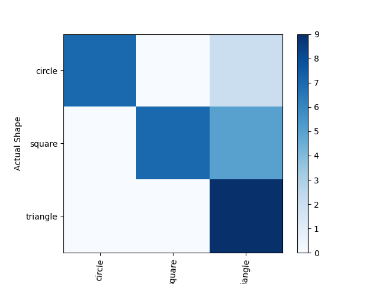

# Laboratory 04

### Save best weights
Added callback instance of ModelChackpoint 
```python
    checkpoint_filepath = 'models/checkpoint'
    model_checkpoint_callback = tf.keras.callbacks.ModelCheckpoint(
        filepath=checkpoint_filepath,
        save_weights_only=True,
        monitor='val_accuracy',
        mode='max',
        save_best_only=True)

    ...
    history = model.fit(
        ...
        callbacks=[model_checkpoint_callback],
        ...)
```

### Create functionality to load best model and predict image
inside `util.py` defined
```python
def load_model_and_predict(model, path, image):
    model.load_weights(path)
    return predict_image(model, image)

```

Compare results of loaded (best) vs most recent weights
```python
    # Use the classifier to predict the class
    class_idx = predict_image(model, img)
    print(f'1: got {classnames[class_idx]}, expected {rand_shape} ({fns.__name__})')

    # Use the classifier to predict the class
    class_idx = predict_image(model, _img)
    print(f'2: got {classnames[class_idx]}, expected {rand_shape} ({fns.__name__})')
```

### Extend scripts with augmentations functions

To augment validation data defined inside `util.py`
```python
def rotate(func):
    def func_wrapper(*args, **kwargs):
        if randint(0, 1) == 0:
            return func(*args, **kwargs)
        return tf.image.rot90(func(*args, **kwargs)).numpy()
    return func_wrapper

@rotate
def brightness(image):
    seed = (randint(0, 3), 0)
    return tf.image.stateless_random_brightness(
        image, max_delta=0.95, seed=seed).numpy()


@rotate
def contrast(image):
    seed = (randint(0, 3), 0)
    return tf.image.stateless_random_contrast(
        image, lower=0.1, upper=0.9, seed=seed).numpy()


@rotate
def crop(image):
    seed = (randint(0, 3), 0)
    return tf.image.stateless_random_crop(
      image, size=[224, 224, 3], seed=seed).numpy()
```

And to augment original data added arguments to the `ImageDataGenerator`
```python
    datagen = ImageDataGenerator(rescale=1. / 255,
                                 horizontal_flip=True,
                                 # width_shift_range=[-20, 20],
                                 rotation_range=90,
                                 # brightness_range=[0.2, 1.0],
                                 validation_split=0.3)
```

### Compare results
Checking how well augmented images can be labeled 
```python
    augmentations = [crop, contrast, brightness]
    for fns in augmentations:
        _img = fns(img)
        plt.imshow(_img)
        plt.show()

        # Use the classifier to predict the class
        class_idx = predict_image(model, img)
        print(f'1: got {classnames[class_idx]}, expected {rand_shape} ({fns.__name__})')

        # Use the classifier to predict the class
        class_idx = predict_image(model, _img)
        print(f'2: got {classnames[class_idx]}, expected {rand_shape} ({fns.__name__})')

        # Use best model
        class_idx = load_model_and_predict(model, checkpoint_filepath, _img)
        print(f'3: got {classnames[class_idx]}, expected {rand_shape} ({fns.__name__})')
```
Examples of augmented data




Results of augmented and original results:

Original learning results


Augmented learning results


Generally results of non-augmented data are better

Examples of comparison output

```shell
1: got triangle, expected triangle (func_wrapper)
1/1 [==============================] - 0s 55ms/step
2: got square, expected triangle (func_wrapper)
1/1 [==============================] - 0s 56ms/step
3: got square, expected triangle (func_wrapper)
1/1 [==============================] - 0s 56ms/step
```

### Fine tunning
Fine-tuning as freezing initial model and adding one more layer
```python
    for layer in base_model.layers:
        layer.trainable = False

    # Create prediction layer for classification of our images
    x = base_model.output
    x = Flatten()(x)
    prediction_layer = Dense(len(classnames), activation='softmax')(x)
    model = Model(inputs=base_model.input, outputs=prediction_layer)

    model.compile(loss='categorical_crossentropy',
                  optimizer='adam',
                  metrics=['accuracy'])

```